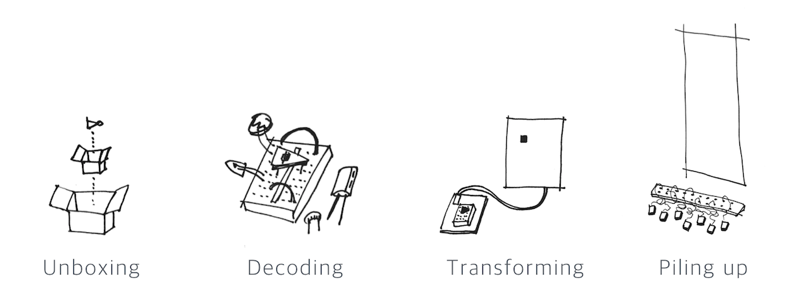
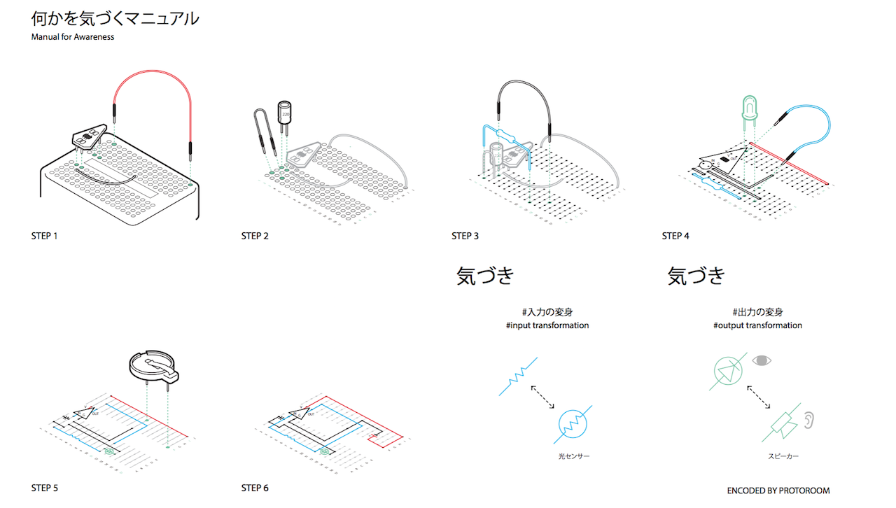
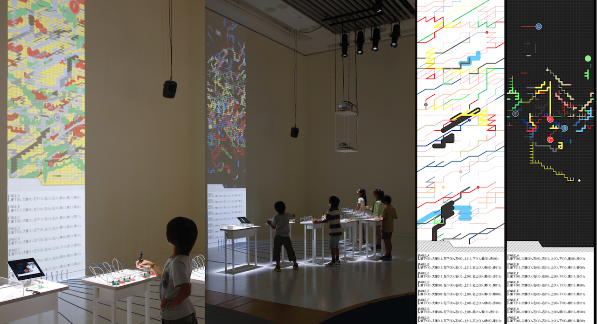

## sensuous transforming of 0 | 1 signal Ver.1 (2016)
 * **PROTOROOM (Hoonida Kim, SeungBum Kim)**
 * [Media Art as an Awareness Filter - NTT ICC](http://www.ntticc.or.jp/en/exhibitions/2016/icc-kids-program-2016-media-art-as-an-awareness-filter/)

‘sensuous transforming of 0 | 1 signal’ 
is an installation work that allows construction of kits 
that allow experience and contemplation on the elements of computing
while converting and transforming the 0,1 bits into different layers 
through workshop and exhibition.

The environment that moves what surrounds us is filled with digital systems, and each system is layered with various digital technologies and black-boxed like ‘folders in folders’. We unbox the basic elements of computing which is 0, 1 instead of the interface with which we are already familiar and attempt alternative methods of conversion and layering.

The workshop conducted to complete the installation work is a process of experiencing and thinking about the technological medium. Through the manual of the kit, the participants create a 1-bit computing device to complete the work. The manual which we provide is not a set of instructions to assemble the end product but a kind of formal language to enable the participants to observe and think about the technological medium more receptively.

The simple 1-bit computing device that is understood through the sensorial conversion creates complexity through direct input in the digital system which operates according to uncomplicated directions. Through such series of processes, we want to reflect on the technical medium that makes up the digital system.

