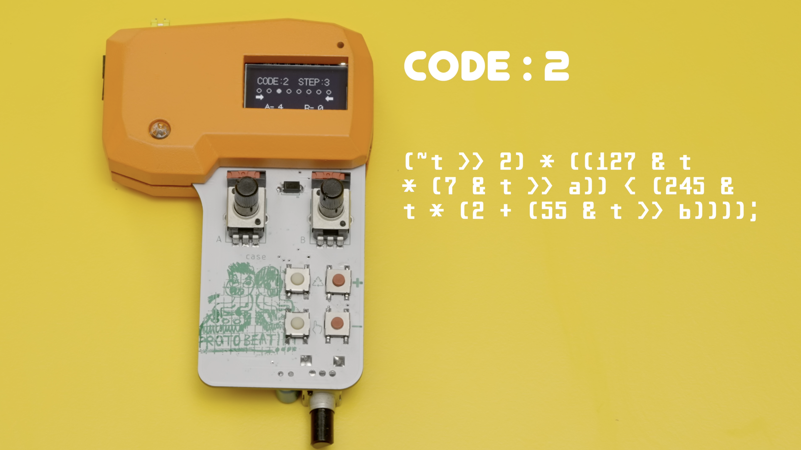
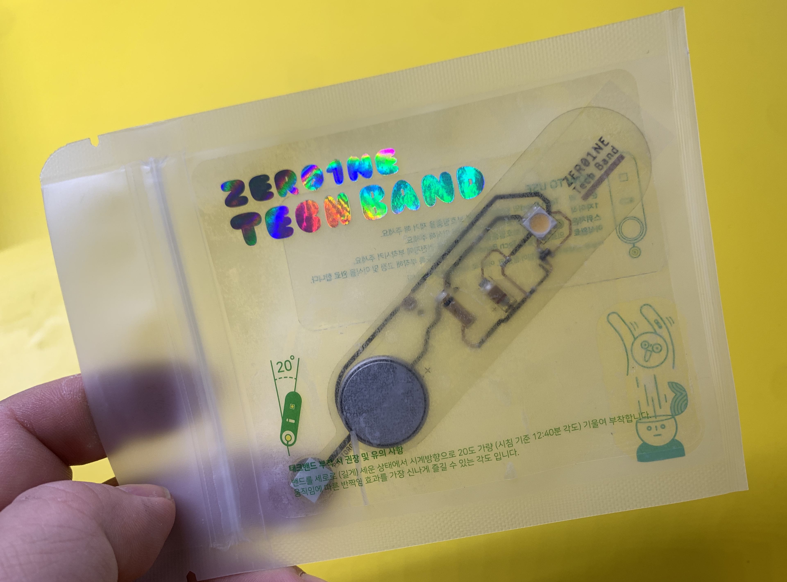

## SmallBig_SØ
**PROTOROOM (Hoonida Kim, Seungbum Kim)**

&nbsp;&nbsp;  
&nbsp;&nbsp;  

### SmallBig_SØ
SmallBig-SØ는 새로운 방향의 사운드 소비방식을 제시하는 프로덕트이자 악기이다. 디지털 시각예술과
게임표현에 큰 영향을 끼친 데모씬(Demoscene) 문화에서 시작된 생성적 알고리즘 사운드를 기반으로 한다.  한 줄(Small)의 수식이 만드는 무한한(Big) 가능성 안에서 즐기듯 원하는 사운드 비트를 찾아가는 "탐색적 작곡"이라는 새로운 감각을 담아내고, 현재 일반적으로 생각하는 악기의 인터페이스를 탈피한 다양한 상호작용을 연결할 "메타 인터페이스"를 구상하고 실험한다.

무의미하게 쌓이고 잊히는 과잉의 데이터 속에서 우리는 익숙함을 넘어 무감각해지고 있다. 적은 문자열 데이터의 조합으로 구성된 수식에서 찾아가는 무한의 사운드 공간은 새로운 사유의 계기가 되고, 실시간으로 생성되는 감각적인 사운드를 다양한 인터페이스로 즐기는 경험은 그 자체로 놀이되며 동시에 새로운 사유의 계기가 될 것이다.

### ZER01NE Day

⟪2022 ZER01NE DAY⟫에서는 PROTOROOM(후니다 킴, 김승범)은 신작 <SmallBig_SØ : 생성적 알고리즘의 탐색적 작곡과 인터페이스 연구>의 프로토타입으로써 쇼케이스 전시와 렉쳐 사운드 퍼포먼스를 선보입니다.  

PROTOROOM의 공연은 9월 30일과 10월 1일 저녁 시간에 만나볼 수 있습니다.  
 * 2022.9.30 / 20:00 - 20:30  
 * 2022.10.1 / 19:30 - 20:00  
  
⟪2022 ZER01NE DAY⟫  
[https://www.zer01neday.com/2022/](https://www.zer01neday.com/2022/)  
 * 일시: 2022. 9. 30 - 2022. 10. 3  
 * 장소: 성수동 에스팩토리 D동

시간: 10:30 - 22:00

### ZER01NE TechBand

 * credit : PROTOROOM 

**TechBand  "나의 움직임을  다른 감각으로 일으키는 밴드."** ZER01NE DAY는 익숙하게 사용해온 일상의 테크놀로지에 무뎌진 나의 사고에 자극을 주고  멈추어 있던 나를 뛰게 한다. 

피부 위에 유연하게 부착될 테크밴드에는 6개의 전자부품이 실장되어 우리의 움직임을 빛으로 전환한다.
새로운 기술 환경에서 자극 받으며, 그동안 멈춰있던 나를 다시 움직일 때, 테크밴드는 빛으로 응답하고, 
그 빛에 주변이 물들며 함께 뛰게 될 것이다.

----
#### PROTOROOM

PROTOROOM is a "metamedia" collective with a creative practice based on the technological medium of KIT. KIT is a meta-medium, leading sensual and cogitative experiences as a mediator of opportunities for discourse and contemplation on technology which has become an undeniable part of ecology. Under the title "Tech x Kit x Critic" evolved series of works in the forms of exhibitions and workshops. The collective has been run by Hoonida Kim and Seungbum Kim since 2014. Recently, they participated with a exhibition X workshop at NTT InterCommunication Center [ICC] ‘Media Art as an Awareness Filer’ (2016, Japan), Nam June Paik Art Center’s exhibition, “Our Bright Future - Cybernetics Fantasy” (2017, Korea) and TRANS BOOKS faire (2018, Japan).

#### Hoonida Kim
 * Metamedia artist / Air sculptor
 * <http://hoonida.com> <http://hoonidalabs.com>

#### Seungbum Kim
 * Metamedia ( tinker \| artist )
 * <https://metakits.cc>
